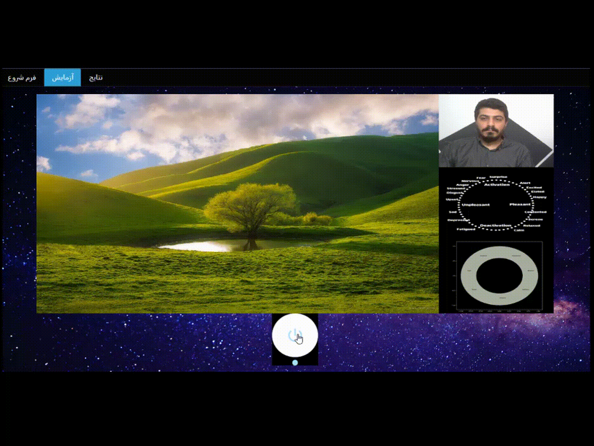
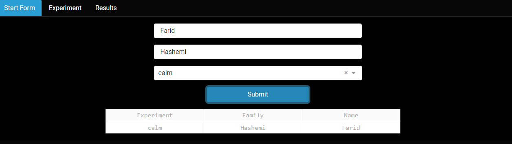
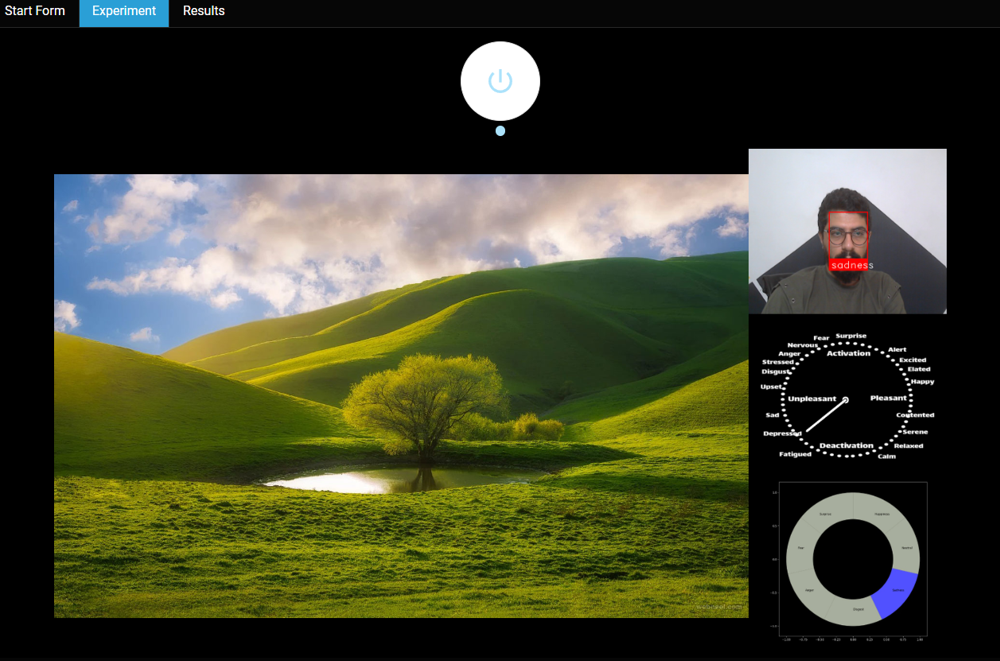
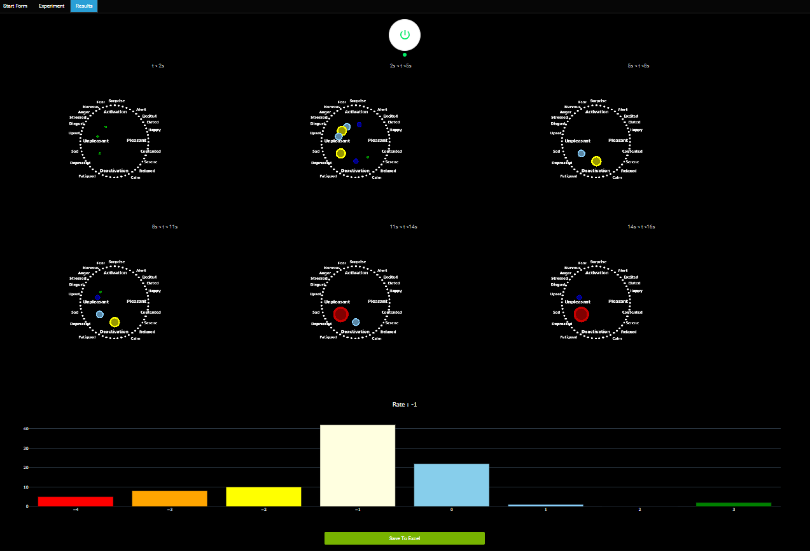

# deep-facial-emotions-recognition-with-ui
In this project, a system is designed to induce emotions and discover the feedback of user emotions using deep learning
The main goal of this project is to use artificial intelligence and deep learning to detect facial emotions.
User interface to register the examiner, select the induction test type
Conducting tests and displaying momentary events and recognizing momentary emotions and matching based on Russell's chart, which is one of the main sources of emotion recognition in psychology, as well as a timed and statistical report of emotions at different times of testing and data recording in Excel.
# Test Video

# Install
install all packages in requirments.txt
# Use
You must use this project in three steps
# Step 1
* run main.py
* go to 127.0.0.1:8050
* in tab Start Form register user in local db and select one emotion
* Submit form

# Step 2
* in Experiment tab you can see your camera stream russel plot and emotion plot and an image for test your reaction
* click on button and in 15 second system start recognize and collect your facial emotions
* you can see realtime russel plot changing and emotion plot changing and realtime face detection and facial emotion recognition

# Step 3
* you can go to Results tab and click on button and see russel plots in different time priods
* and you can see your emotion rate from -4 to 3 means bad emotion to good emotion
* click the save button and save results to excel file in reports folder

